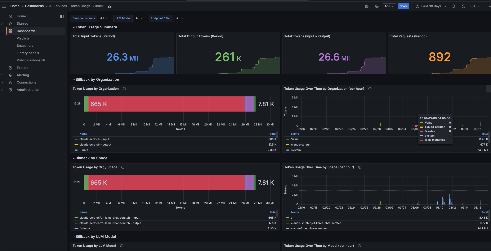
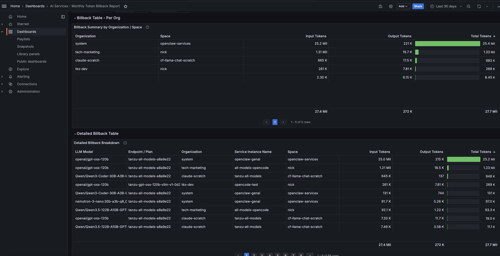
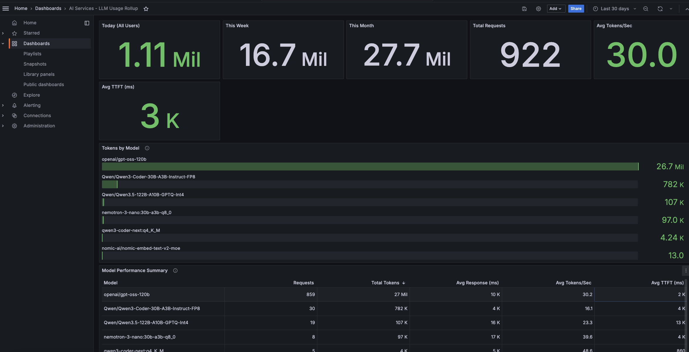
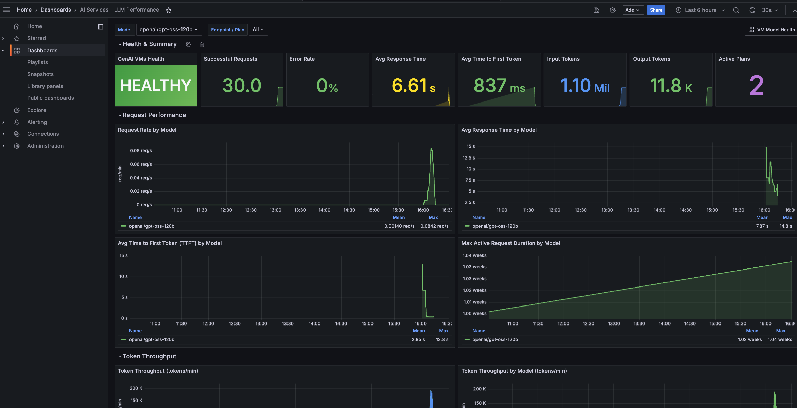
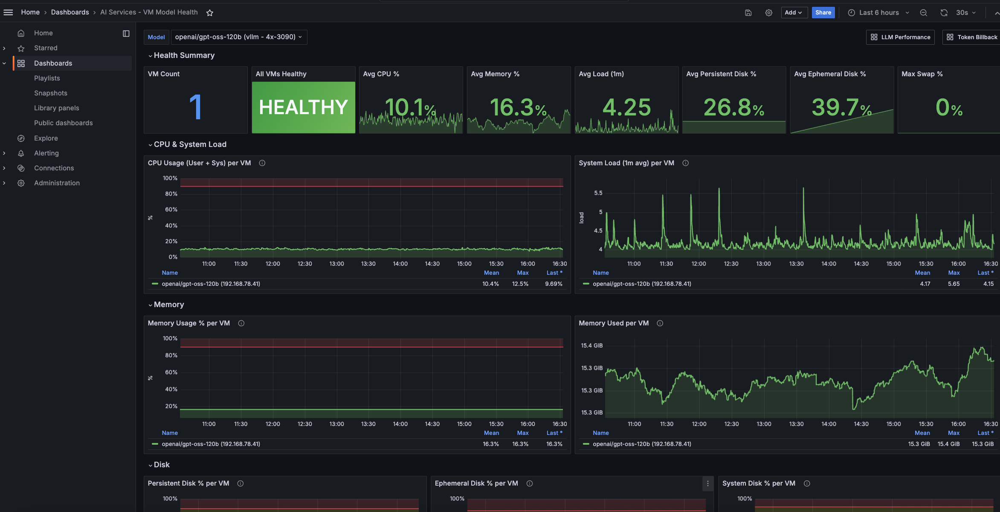
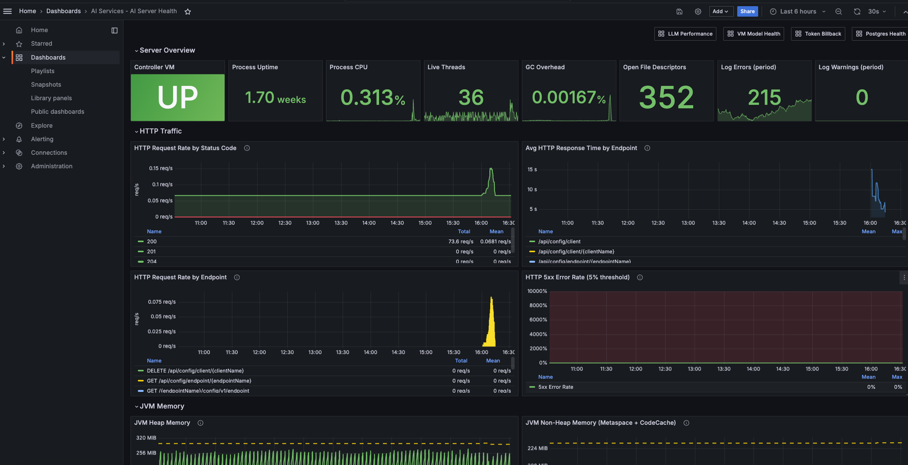
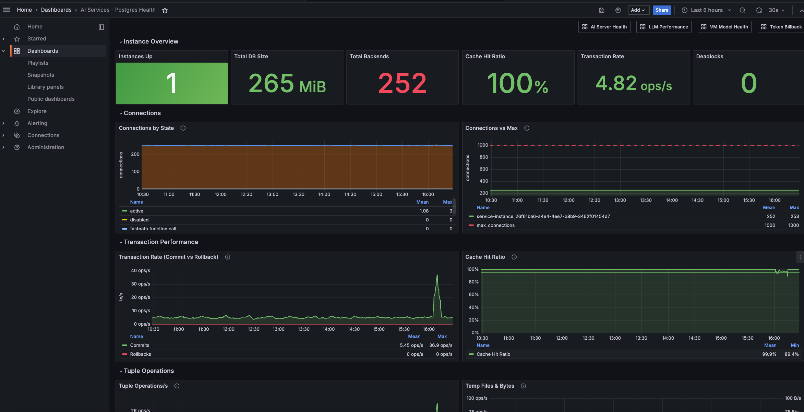

# AI Services Healthwatch Dashboards

Grafana dashboards for monitoring and billing of [VMware Tanzu AI Services](https://techdocs.broadcom.com/us/en/vmware-tanzu/platform/ai-services/10-3/ai/index.html) with [Healthwatch for Tanzu](https://techdocs.broadcom.com/us/en/vmware-tanzu/platform/healthwatch-for-vmware-tanzu/2-3/healthwatch/index.html).

## Dashboards

### AI Services - Token Usage Billback

**File:** `ai-services-billback-dashboard.json`

A chargeback/billback dashboard that breaks down AI token usage by Cloud Foundry organization, space, LLM model, service plan/endpoint, and service instance — including service key consumers.



#### Features

- **Organization, Space, Service Instance, Model, and Endpoint dropdowns** for filtering token usage
- Summary stats: total input, output, and combined tokens for the selected time period
- Bar charts and time series by org, space, model, endpoint, and service instance
- Detailed billback table with input/output/total token breakdown per app/service key
- Billback summary table aggregated by organization and space

---

### AI Services - Monthly Token Billback Report

**File:** `ai-services-monthly-billback-report.json`

A focused monthly reporting view with per-org summary and detailed billback breakdown tables. Default time range: 30 days.



#### Features

- **Billback Summary by Organization / Space** — aggregated input, output, and total tokens per org/space
- **Detailed Billback Breakdown** — per-model, per-endpoint, per-service-instance, per-app/service-key token counts
- Same dropdown filters as the Token Usage Billback dashboard

---

### AI Services - LLM Usage Rollup

**File:** `ai-services-llm-usage-rollup-dashboard.json`

A global view of LLM token consumption and model performance across all service instances. No filters — shows everything.



#### Features

- **Token stats** — Today, This Week, This Month totals, plus total requests, avg tokens/sec, and avg TTFT
- **Tokens by Model** — horizontal bar chart ranking models by total token consumption
- **Model Performance Summary** — table with requests, tokens, avg response time, avg tokens/sec, and avg TTFT per model
- **Avg Tokens/Second by Model** and **Avg TTFT by Model** — bar charts for quick comparison

---

### AI Services - LLM Performance

**File:** `ai-services-llm-performance-dashboard.json`

A centralized operations dashboard for monitoring LLM health and performance. Select a model (e.g., `openai/gpt-oss-120b`) and see consolidated performance across all plans/endpoints serving it.



#### Features

- **Model & Endpoint dropdowns** — select a model to see consolidated stats across all plans mapped to it
- **Health summary** — VM health status, request count, error rate, avg response time, avg TTFT, token counts, active plan count
- **Request performance** — request rate, avg response time, time to first token (TTFT), max active request duration over time, all by model
- **Token throughput** — input/output tokens per minute, broken down by model
- **Error analysis** — errors by type (TooManyRequests, IOException, etc.), error rate by model with 5% threshold line
- **Per-endpoint breakdown** — request rate and response time by service plan/endpoint
- Links to the **VM Model Health** dashboard for underlying VM resources

---

### AI Services - VM Model Health

**File:** `ai-services-vm-model-health-dashboard.json`

Detailed VM-level health and resource monitoring for the BOSH VMs serving LLM models. Select a model from the dropdown to see only the VMs running that model.



#### Features

- **Model dropdown** — select a model to filter to only its VMs; shows model name, provider (vllm/ollama), and VM type
- **Health summary** — VM count, health status, avg CPU/memory/load/disk, max swap
- **CPU & Load** — per-VM CPU utilization and system load over time
- **Memory** — per-VM memory percentage and absolute usage
- **Disk** — persistent, ephemeral, and system disk usage per VM
- **Swap** — swap usage over time (high swap degrades inference performance)
- **VM status table** — at-a-glance table with health, CPU, memory, load, disk, and swap

---

### AI Services - AI Server Health

**File:** `ai-services-ai-server-health-dashboard.json`

Application-level health monitoring for the AI Server process, covering JVM internals, HTTP traffic, database connection pooling, and the controller VM.



#### Features

- **Server Overview** — controller VM health, process uptime, CPU usage, live threads, GC overhead, open file descriptors, log errors/warnings
- **HTTP Traffic** — request rate by status code (2xx/4xx/5xx), avg response time by endpoint, request rate by endpoint, 5xx error rate with threshold
- **JVM Memory** — heap used vs committed, non-heap used vs committed, heap breakdown by memory pool (Eden/Survivor/Old Gen), GC pause rate & duration
- **Database Connection Pool (HikariCP)** — active/idle/pending/max connections, pool timeouts
- **Threads & Logging** — thread states (runnable, waiting, blocked), log events by level (error, warn, info, debug)
- **Controller VM Resources** — CPU, memory, and disk utilization for the controller VM
- Links to **LLM Performance**, **VM Model Health**, and **Token Billback** dashboards

---

### AI Services - Postgres Health

**File:** `ai-services-postgres-health-dashboard.json`

Health monitoring for the on-demand Postgres service instances backing AI Services. Covers both Postgres-level metrics (from `postgres_exporter`) and BOSH VM resources.



#### Features

- **Instance dropdown** — filter by deployment name (Postgres service instance) with All option
- **Instance Overview** — instances up, total DB size, total backends, cache hit ratio, transaction rate, deadlocks
- **Connections** — connections by state (stacked), connections vs max_connections (with red dashed limit line)
- **Transaction Performance** — commit vs rollback rate (green/red), cache hit ratio over time with 95% threshold
- **Tuple Operations** — fetched/inserted/updated/deleted rates, temp files & bytes
- **Locks & Long Transactions** — locks by mode (stacked bars), max transaction duration by state
- **WAL & Checkpoints** — WAL size over time, checkpoint rate (timed/requested) with bgwriter buffer stats
- **VM Resources** — CPU, memory, and disk utilization per Postgres VM
- **Table Statistics** (collapsed) — top tables by size (bar gauge), dead tuples needing vacuum
- Links to **AI Server Health**, **LLM Performance**, **VM Model Health**, and **Token Billback** dashboards

## Prerequisites

- GenAI / AI Services tile v10.0.0 or later
- Healthwatch and Healthwatch Exporter tiles v2.3.1 or later

## Installation

1. Log in to Grafana at `https://grafana.<SYSTEM_DOMAIN>`
   - Credentials are in Ops Manager under the Healthwatch tile > Credentials tab > Grafana Credentials
2. Navigate to **Dashboards > New > Import**
3. Copy the contents of the desired dashboard JSON and paste into the **Import via panel json** window
4. Click **Load**, then **Import**

All dashboards use the default Prometheus datasource (`"uid": null`), which auto-connects to Healthwatch's Prometheus.

### VM-to-Model name mapping

The `genai-models` BOSH VMs use UUID job names (`exported_job` label) with no built-in association to the LLM model they serve. The included script `scripts/configure-vm-model-mapping.sh` queries OpsManager to discover this mapping and patches the VM Model Health and LLM Performance dashboard JSON files.

```bash
# Requires: om CLI, jq, python3
./scripts/configure-vm-model-mapping.sh -e /path/to/om-env.yml
```

### Billback service instance mapping

On foundations where `ai_server_*` metrics do not carry native CF identity labels (`platform_cf_org_name`, `platform_cf_space_name`, `platform_cf_service_instance_name`), the billback dashboards require a mapping script to resolve service instance GUIDs to human-readable names.

```bash
# Requires: curl, python3
./scripts/configure-billback-mapping.sh \
  --cf-api https://api.sys.<DOMAIN> \
  --cf-user admin \
  --cf-password <password>
```

**Re-running after changes:** Restore the clean dashboards from git and re-run:

```bash
git checkout -- ai-services-billback-dashboard.json ai-services-monthly-billback-report.json
./scripts/configure-billback-mapping.sh --cf-api ... --cf-user ... --cf-password ...
```

## Metrics Used

| Metric | Description |
|--------|-------------|
| `ai_server_client_token_usage_total` | Cumulative token count by model, endpoint, token type, space, and app |
| `ai_server_requests_seconds_count/sum` | Request count and total duration |
| `ai_server_requests_active_seconds_count/sum/max` | Active request count and duration |
| `gen_ai_server_time_to_first_token_seconds_count/sum` | Time to first token (TTFT) |
| `gen_ai_client_operation_seconds_count/sum` | Client-side operation duration |
| `jvm_memory_used_bytes`, `jvm_memory_committed_bytes` | JVM heap and non-heap memory |
| `jvm_gc_pause_seconds_count/sum` | Garbage collection frequency and duration |
| `hikaricp_connections_active/idle/pending/max` | HikariCP database connection pool |
| `http_server_requests_seconds_count/sum` | HTTP request count and duration |
| `system_cpu_user`, `system_mem_percent`, `system_disk_*_percent` | BOSH VM resources |
| `system_healthy`, `system_load_1m`, `system_swap_percent` | BOSH VM health, load, swap |
| `pg_up`, `pg_stat_database_*`, `pg_stat_activity_*` | Postgres database metrics |
| `pg_locks_count`, `pg_wal_size_bytes`, `pg_stat_bgwriter_*` | Postgres locks, WAL, checkpoints |

### Key labels on `ai_server_client_token_usage_total`

| Label | Description |
|-------|-------------|
| `gen_ai_token_type` | `input`, `output`, or `total` |
| `ai_server_advertised_model` | LLM model name |
| `ai_server_endpoint` | Service endpoint / plan name |
| `platform_cf_org_name` | CF organization name |
| `platform_cf_space_name` | CF space name |
| `platform_cf_service_instance_name` | CF service instance name |
| `platform_cf_service_instance_guid` | CF service instance GUID |
| `platform_cf_app_name` | CF app name or service key name |
| `platform_cf_app_guid` | CF app GUID (prefixed `sk-` for service keys) |
| `platform_cf_space_guid` | CF space GUID |
